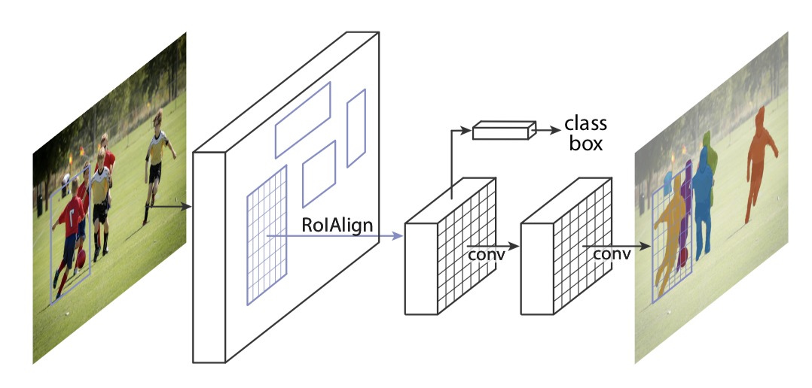
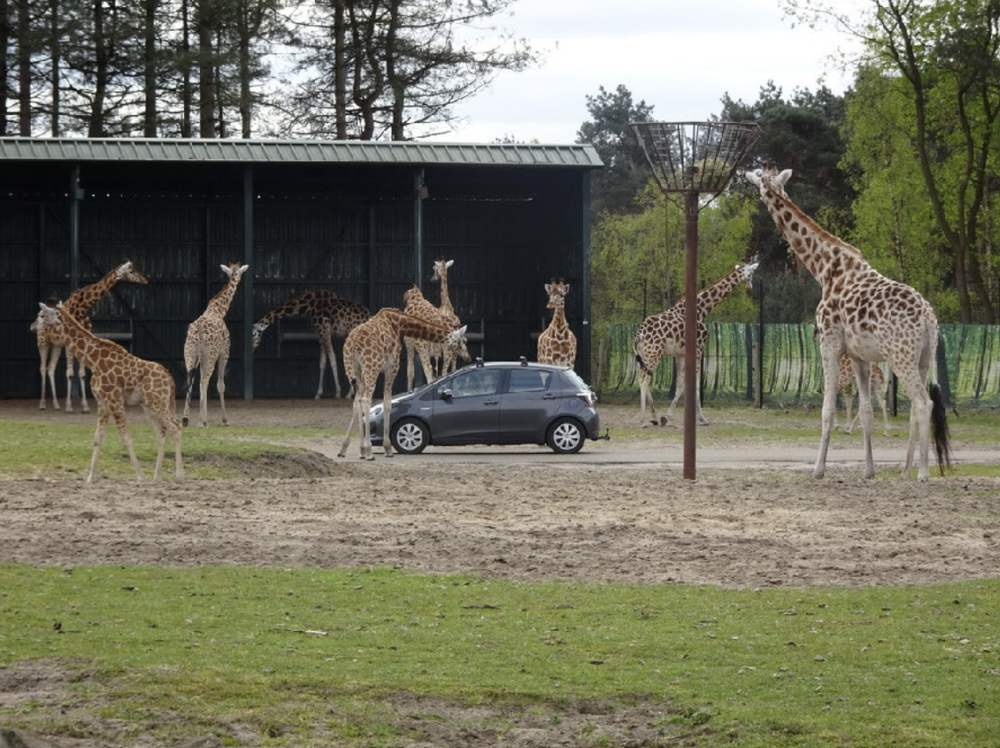
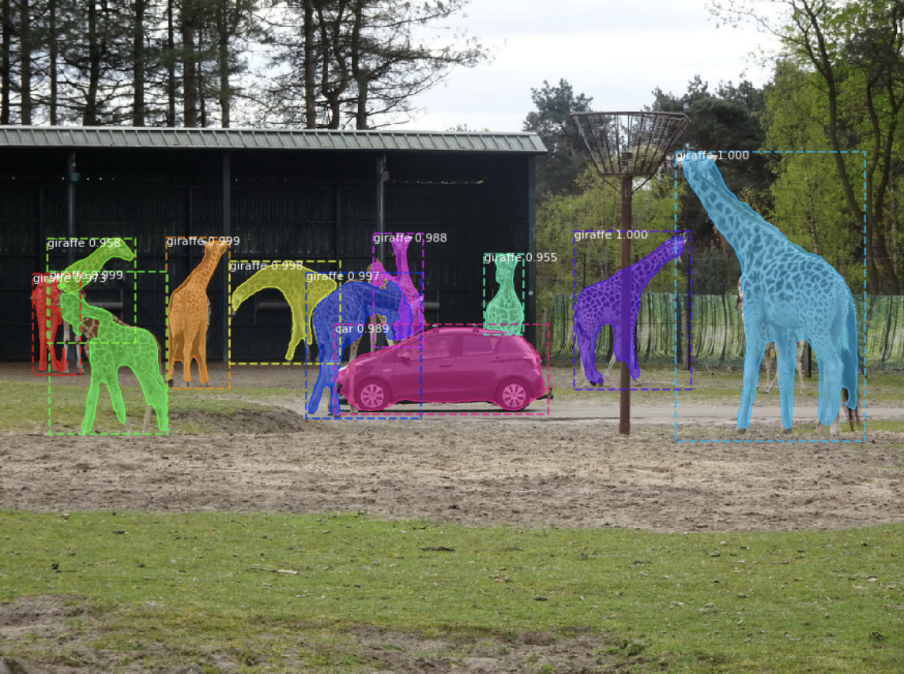

# Image detection and classification using [Mask R-CNN](https://arxiv.org/pdf/1703.06870.pdf)

This tutorial is one of the demos used in the course “Introduction to Machine Learning” at MINES ParisTech - 
PSL Research University, lectured by [Simon Tamayo](https://www.mines-paristech.fr/Services/Annuaire/simon-tamayo).

This code uses a deep convolutional neural network, and more precisely [Mask R-CNN](https://arxiv.org/pdf/1703.06870.pdf)
to detect and classify the objects present in an input image. Mask R-CNN does the following:

 
*image borrowed from the [original paper presenting mask rcnn](https://arxiv.org/pdf/1703.06870.pdf)

Here is what Mask R-CNN does:

1. From an _input_image_:

 

2. You can identify the objects in the image, classify them and also obtain their masks:

 

## Acknowledgement

This demo was adapted from the [Matterport tutorial on Mask_RCNN](https://github.com/matterport/Mask_RCNN/tree/master/samples) 
which implements [Mask R-CNN](https://arxiv.org/pdf/1703.06870.pdf). 
Mask R-CNN efficiently detects objects in an image while simultaneously generating a high-quality segmentation mask 
for each instance (developed by Kaiming He, Georgia Gkioxari, Piotr Dollár, Ross Girshick).

## Getting Started

Before running this code make sure you have Python3 and the packages: numpy, scipy, Pillow, cython, matplotlib, 
scikit-image, tensorflow>=1.3.0, keras>=2.0.8, opencv-python, h5py, imgaug.

Please note that in order to run this code you also need to download the pre-trained COCO weights (mask_rcnn_coco.h5) 
from [here](https://github.com/matterport/Mask_RCNN/releases/download/v2.0/mask_rcnn_coco.h5), and place it in the root 
directory of this code.

## MASK R-CNN

This tutorial uses the deep neural network MASK R-CNN developed by K. He, G. Gkioxar, P. Dollar and R. Girshick
from Facebook AI Research (FAIR). Mask R-CNN is an instance segmentation model that can identify pixel by pixel location 
of any object, returning a classification result and a mask for the location of the instance in the image.

## Built With

* [Mask R-CNN](https://arxiv.org/pdf/1703.06870.pdf) - Deep neural network 
* [COCO](http://cocodataset.org/#home) - Image data set used to train Mask R-CNN

This project is licensed under the MIT License - see the [LICENSE.md](https://opensource.org/licenses/mit-license.php) file for details
